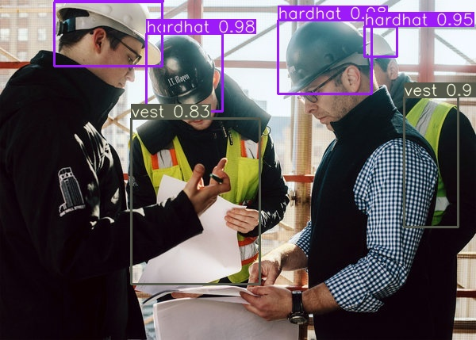

# YOLO V3

## Training YOLOV3 with custom dataset
Original credit goes to this [repo.](https://github.com/ultralytics/yolov3)
Additionally we also have to change the Filters parameter as mentioned [here.](https://medium.com/@quangnhatnguyenle/how-to-train-yolov3-on-google-colab-to-detect-custom-objects-e-g-gun-detection-d3a1ee43eda1#120b)

```math
filters = (classes + 5)*3
```
The network was trained for a total of 300 epochs.


` `
Sample Ouput's on the custom dataset:



` `


As mentioned in the assignment ffmpeg was recommended to use. Because of our prior experience in using OpenCV we used it to both seperate and merge the frames.

To seperate the images

```python
import cv2
vidcap = cv2.VideoCapture("video.mp4")
count = 0
while True:
    success,image = vidcap.read()
    if not success:
        break
    cv2.imwrite(os.path.join("{:d}.jpg".format(count)), image)     # save frame as JPEG file
    count += 1
```

To merge the frames after running inference.
```python
import cv2
import numpy as np
import os

def frames_to_video(inputpath,outputpath,fps):
   image_array = []
   files = sorted(os.listdir(inputpath),key = lambda x :int(x.split(".")[0]))
   for i in range(len(files)):
       img = cv2.imread(inputpath + files[i])
       size =  (img.shape[1],img.shape[0])
       img = cv2.resize(img,size)
       image_array.append(img)
   fourcc = cv2.VideoWriter_fourcc('D', 'I', 'V', 'X')
   out = cv2.VideoWriter(outputpath,fourcc, fps, size)
   for i in range(len(image_array)):
       out.write(image_array[i])
   out.release()


inputpath = '/video_output/'
outpath =  'final_video.mp4'
fps = 29
frames_to_video(inputpath,outpath,fps)
```


[Final Video:](http://www.youtube.com/watch?v=1ruys6NzdQI )

[](http://www.youtube.com/watch?v=1ruys6NzdQI "")


ToDO:

1.Train Yolo(for any other model also) with a low resolution images for some epochs and increase resolution afterwards.

2.Change the default anchor boxes in Yolo.

3.Add sound back to the annotated video.


References:
http://embedyoutube.org/

